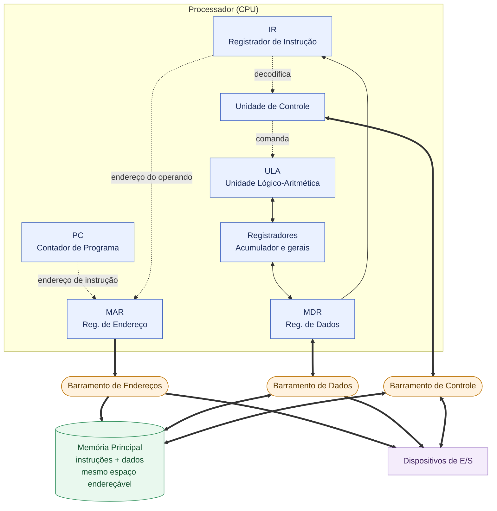

# Arquitetura de Von Neumann
**Núcleo.** Computador de programa armazenado: instruções e dados residem na mesma memória e são acessados pelo mesmo caminho, de modo que o programa é tratado como dado manipulável e não mais como fiação fixa da máquina, como era antes.

**Síntese.** A arquitetura organiza a máquina em quatro partes: unidade de controle e unidade lógico-aritmética (juntas formando a CPU), memória e dispositivos de entrada e saída, ligadas por um barramento comum. O ponto decisivo é o princípio do programa armazenado: como código e dados compartilham o mesmo espaço de endereçamento, um programa pode ler, gerar e modificar outro. O ciclo de execução busca uma instrução na memória, decodifica-a e a executa, avançando um contador de programa que determina o próximo endereço.

## Diagrama
O diagrama abaixo é uma representação simplificada da arquitetura de Von Neumann, aproximadamente tal como pelas CPUs atuais.

## Registradores
**PC (Contador de Programa).** Registrador que guarda o endereço da próxima instrução a ser buscada na memória. É incrementado a cada ciclo de busca (ou substituído em desvios/saltos), determinando o fluxo sequencial ou desviado da execução.

**IR (Registrador de Instrução).** Guarda a instrução recém-buscada da memória, servindo de entrada para a unidade de controle decodificar o opcode e os operandos antes da execução.

**MAR (Registrador de Endereço de Memória).** Guarda o endereço de memória a ser acessado na próxima operação de leitura ou escrita, sendo a interface entre a CPU e o barramento de endereços.

**MDR (Registrador de Dados de Memória).** Guarda o dado que está sendo transferido entre a CPU e a memória, seja um valor lido, seja um valor a ser escrito, funcionando como intermediário no barramento de dados.

**Acumulador e registradores gerais.** Armazenam operandos e resultados intermediários das operações realizadas pela ULA, evitando acessos repetidos e mais custosos à memória principal.

---
# Processo de compilação
**Núcleo.** Compilação é a tradução de código-fonte em código executável por meio de fases sequenciais: análise léxica, sintática e semântica, seguidas de geração e otimização de código, até produzir um binário ligado e pronto para execução.

**Síntese.** O compilador divide o trabalho em front-end e back-end. O front-end faz análise léxica (tokens), análise sintática (árvore de derivação, a AST) e análise semântica (checagem de tipos, escopos, resolução de símbolos), produzindo uma representação intermediária (IR). O back-end otimiza essa IR e gera código de máquina para uma arquitetura-alvo. Por fim, o linker resolve referências entre módulos e bibliotecas, produzindo o executável final.

## Fases de compilação de um programa em geral
| Etapa | Descrição |
| --- | --- |
| Análise léxica (scanning) | Converte a sequência de caracteres do código-fonte em tokens (palavras-chave, identificadores, literais, operadores), usando autômatos finitos para reconhecer os padrões. |
| Análise sintática (parsing) | Consome os tokens e constrói a árvore sintática abstrata (AST), validando se a estrutura obedece à gramática livre de contexto da linguagem. |
| Análise semântica | Percorre a AST verificando propriedades que a gramática não captura: checagem de tipos, escopos, resolução de símbolos e de sobrecarga. Erros típicos aqui são tipo incompatível ou identificador não declarado. |
| Geração de código intermediário | Traduz a AST validada para uma representação intermediária (IR), como código de três endereços ou forma SSA, independente da arquitetura-alvo. |
| Otimização | Aplica transformações sobre a IR para melhorar desempenho ou tamanho do código: eliminação de código morto, propagação de constantes, inlining de funções, entre outras. |
| Geração de código de máquina | Traduz a IR otimizada em instruções da arquitetura-alvo, cuidando de alocação de registradores e convenções de chamada de função. |
| Montagem (assembly) | O montador converte o código de máquina textual em código objeto relocável (binário, mas ainda com referências não resolvidas). |
| Ligação (linking) | O ligador combina múltiplos arquivos objeto e bibliotecas, resolve símbolos e endereços externos, e produz o executável final. |
## Fases de compilação de Scala 3 para JVM
| Etapa | Descrição |
| --- | --- |
| Scanner (análise léxica) | Converte o texto-fonte `.scala` em tokens, reconhecendo identificadores, literais, palavras-chave e operadores. |
| Parser (análise sintática) | Constrói a árvore sintática (untyped tree) a partir dos tokens. |
| Namer | Popula os símbolos (denotations) para classes, métodos e membros declarados, resolvendo a estrutura de escopos antes da checagem de tipos completa. |
| Typer | Faz a inferência e checagem de tipos, elaborando a árvore não-tipada em uma árvore tipada. Aqui ocorre a resolução de `given`/`using`, verificação de match types, union e intersection types, e opacos. |
| Inlining | Expande chamadas a métodos `inline` e resolve macros baseadas em `inline` mais `quotes`/`splices`, substituindo o corpo inline no local da chamada antes das fases seguintes. |
| PostTyper | Faz ajustes estruturais sobre a árvore já tipada: geração de métodos sintéticos (como `equals`/`hashCode` para case classes), checagens adicionais e preparação para o pickling. |
| Pickler (geração de TASTy) | Serializa a árvore tipada no formato TASTy, a representação intermediária própria do Scala 3 que preserva tipos e permite separar compilação e reflexão de macros entre módulos. |
| Fases de simplificação (miniphases) | Uma sequência de miniphases (como remoção de padrões complexos, expansão de for-comprehensions, eliminação de by-name parameters, tratamento de extension methods) reduz progressivamente a árvore a construções mais simples e uniformes. |
| Erasure | Apaga a informação de tipos genéricos e dependentes, convertendo a árvore para o modelo de tipos da JVM (type erasure), inserindo casts e pontes necessárias. |
| Fases pós-erasure | Miniphases adicionais sobre a árvore já com tipos apagados, incluindo otimizações de baixo nível e preparação final da estrutura para geração de bytecode. |
| GenBCode (geração de bytecode) | Traduz a árvore final em bytecode JVM (arquivos `.class`), a etapa correspondente à geração de código de máquina no pipeline tradicional. |
---
# Linguagens de Programação
## Estaticamente tipadas
**Núcleo.** Numa linguagem estaticamente tipada, os tipos de todas as expressões são verificados antes da execução, sobre o código-fonte do programa. O compilador rejeita programas malformados sem rodá-los, garantindo de em tempo de compilação a ausência de uma classe inteira de erros de tipo.

**Síntese.** Um sistema de tipos é uma abstração computável da semântica: cada tipo aproxima por cima o conjunto de valores que uma expressão pode produzir, e verificar tipos é conferir que essas aproximações encaixam ao longo do programa. Como a boa formação em execução é indecidível, a abstração precisa ser conservadora, aceitando um subconjunto próprio dos programas que de fato rodariam sem erro. O que se ganha é uma prova, obtida em tempo finito sobre o texto, de que nenhum programa aceito atinge um estado sem sentido.

## Dinamicamente tipadas
**Núcleo.** Numa linguagem dinamicamente tipada, o tipo pertence a expressão em tempo de execução, não em tempo de compilação. A verificação de tipos é adiada para o tempo de execução, onde uma operação incompatível vira erro em vez de ser rejeitada antes de rodar.

**Síntese.** O tipo mora no valor ao invés da vinculação de nomes. Cada valor carrega uma etiqueta que é consultada em tempo de execução a cada operação: antes de somar, indexar ou chamar um método, o sistema confere se a etiqueta admite aquela ação e, se não, levanta erro. Não há fase de verificação prévia, a disciplina inteira acontece durante a execução. Isso é ortogonal a sua força (forte/fraca), e traz duck typing e metaprogramação como subprodutos naturais.
---
# Definições
**Barramento.** Conjunto de linhas físicas compartilhadas por onde CPU, memória e dispositivos de E/S trocam sinais (endereços, dados ou controle). Por ser compartilhado, apenas um emissor pode usá-lo por vez, o que faz do barramento um gargalo estrutural da arquitetura de Von Neumann.

**Autômato finito.** Modelo computacional com um número finito de estados e transições determinadas pelo símbolo lido, sem memória auxiliar. É o mecanismo por trás da análise léxica: cada padrão de token (identificador, número, operador) corresponde a um caminho de estados que o scanner percorre caractere a caractere.

**Gramática.** Conjunto finito de regras de escrita que especifica como símbolos não-terminais se expandem em sequências de outros símbolos, terminais ou não-terminais, a partir de um símbolo inicial. É a estrutura formal que define, por derivação, todas as sentenças válidas de uma linguagem.

**Símbolo não-terminal.** Símbolo de uma gramática que representa uma categoria sintática abstrata (como "expressão" ou "bloco") e que ainda pode ser reescrito por outras regras, em oposição a um símbolo terminal, que corresponde a um token concreto da linguagem e não se expande mais. A derivação de uma sentença parte do símbolo inicial e substitui não-terminais sucessivamente até restarem só terminais.

**Gramática livre de contexto.** Conjunto de regras de escrita em que o lado esquerdo é sempre um único símbolo não-terminal, suficiente para descrever estruturas aninhadas (parênteses, blocos, expressões) que autômatos finitos não capturam. É a base formal sobre a qual o parser valida a sintaxe de uma linguagem.

**Token.** Instância concreta de um símbolo terminal, produzida pelo scanner a partir do texto-fonte, carregando um tipo (identificador, número, operador) e geralmente um valor e uma posição. É a unidade que o parser consome para construir a árvore sintática.

**Sentença ou frase.** Sequência de símbolos terminais (tokens) que pode ser obtida a partir do símbolo inicial de uma gramática por meio de uma sucessão de derivações. É uma cadeia concreta e finita, não a gramática em si.

**Linguagem (formal).** Conjunto de todas as sentenças que uma gramática é capaz de gerar, ou, de forma equivalente, que um autômato é capaz de reconhecer. Define o universo completo de programas sintaticamente válidos, e não uma sentença isolada.

**Forma SSA (Static Single Assignment).** Representação intermediária em que cada variável é atribuída exatamente uma vez; usos subsequentes de um mesmo nome lógico geram novas versões (ex.: `x1`, `x2`). Essa unicidade simplifica análises de otimização, como propagação de constantes e eliminação de código morto, porque cada definição tem um único ponto de origem.

**Código de três endereços.** Representação intermediária em que cada instrução tem no máximo um operador e três operandos (dois de entrada, um de saída), como `t1 = a + b`. Serve de ponto intermediário entre a AST, de alto nível, e o código de máquina, de baixo nível.

**Type soundness.** Propriedade que garante que todo programa aceito pela checagem de tipos está livre de uma classe definida de erros em tempo de execução. É a garantia formal por trás da promessa de que "programas bem tipados não travam" com erro de tipo.

**Duck typing.** Disciplina em que a validade de uma operação depende apenas de a expressão suportar o comportamento exigido no momento do uso ("se anda como pato e grasna como pato..."), não de uma classificação de tipo declarada previamente. É uma consequência natural da tipagem dinâmica, já que a verificação ocorre sobre o valor concreto em tempo de execução.

**Metaprogramação.** Capacidade de um programa tratar código (seu próprio ou de outro programa) como dado: gerar, inspecionar ou transformar código em tempo de compilação ou de execução.

**JVM (Java Virtual Machine).** Máquina virtual que executa bytecode (arquivos `.class`) independente da arquitetura de hardware subjacente, fornecendo carregamento de classes, verificação de bytecode, gerenciamento automático de memória (garbage collector) e compilação just-in-time. É um dos possíveis alvos de execução comum a linguagens como Java, Scala e Kotlin, que podem ser compiladas para o mesmo formato de bytecode.
